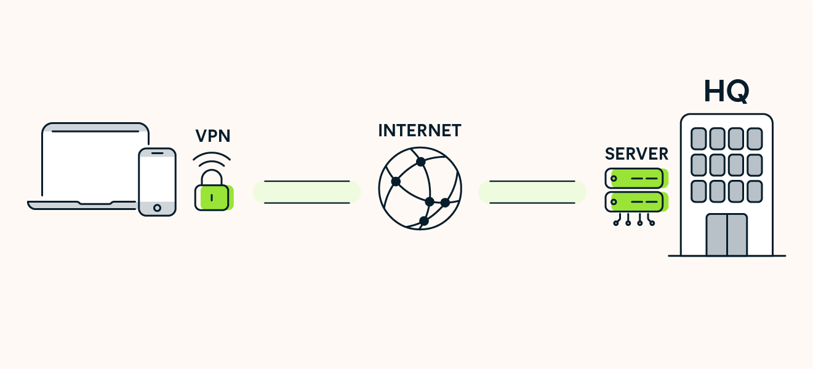

# VPN (Virtual Private Network)
- Oferece conexões seguras e criptografadas entre dispositivos e uma rede pública.
- Usamos VPN para proteger nossa atividade e privacidade na internet contra acesso ou monitoramento de terceiros.

## Os principais componentes de uma VPN são:
- Cliente VPN -> O software instalado no dispositivo que se conecta ao servidor VPN.
- Servidor VPN -> O servidor remoto que gerencia e criptografa o tráfego.
- Criptografia -> É o processo de transformação de dados em código ilegível.

## Como funciona?
- Conectamos com uma VPN.
- O endereço IP do dispositivo é substituído pelo endereço IP do servidor VPN.
- Faz parecer que sua atividade na internet parte da localização do servidor.

## Alguns serviços VPN confiáveis:
- ExpressVPN
- NordVPN
- CyberGhost

