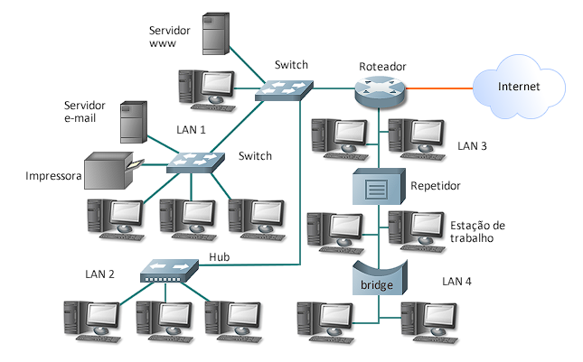

# Dispositivos de Rede
  Os equipamentos de rede são os hadwares responsáveis pela comunição entre os computadores. Falarameos aqui sobre os conectadores e os roteadores. 

  

## HUBs
  São dispositivos conectadores, conectam diferentes dispositivos transmitindo pacote de dados para todos os dipositivos de rede. 

## SWITCHES
  São semelhantes ao HUB, porém transmitem pacotes de dados para dispositivos específicos, em vez de transmitir para todos. 
  Atualmente é mais comum a ultilização de SIWTCHES do que dos HUBs. 

## SWITCHES VS HUBs
  Ambos sao conectadores, ou seja, cabos de rede são conectados a esses equipamentos.
  - ### Qual a diferença entre eles ?  
    A diferença entre eles é que o <strong>SWITCH</strong> é mais inteligente e mais seguro. Isso acontece por que quando o <strong>HUB</strong> recebe um pacote de informações para enviar a uma máquina de rede ele simplesmente envia o pacote para todos conectados nela em um processo conhecido como <strong>broadcast</strong>, diferente do <strong>SWITCH</strong> que os envia para determinada máquina.   

## ROTEADORES 
  São os equipamentos que direcionam os pacotes de dados e fornecem o melhor caminho para que os pacotes de dados cheguem ao seu destino.

## FIREWALLS
  São dispositivos ou softwares que monitoram e filtram o tráfego de entrada e saída da rede, permitindo somente a passagem de dados autorizados. 

## PLACAS DE REDE
  São equipamentos de hadware que permitem que os dispositivos se conectem com a uma rede.