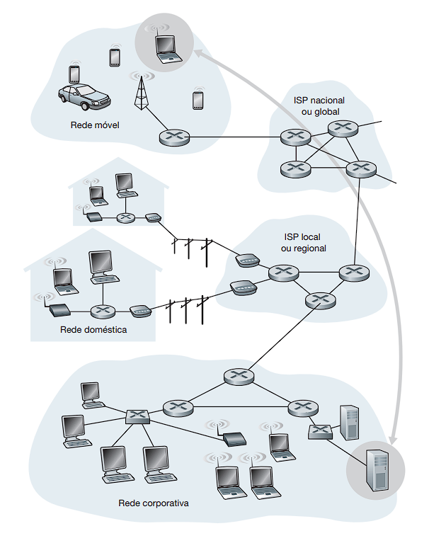

# Tipos de Rede
  Existem vários tipos de rede com base na quantidade de dispositivos que conectam e as distâncias que cobrem.  
  Irei falar um pouco sobre algumas das mais comuns.

  

## REDE DA ÁREA PESSOAL (PAN)
  Conecta os dispositivos em um espaço de trabalho individual, normalmente cobre aproximadamente 10 metros.

## REDE LOCAL (LAN)
  Muito utilizado em casas e escritorios, conecta vários computadores e outros dispositivos dentro dessa pequena área.

## REDE METROPOLITANA (MAN)
  Conecta diversas Redes Locas "de uma mesma empresa" dentro de algumas dezenas de quilometros. 

## REDE DE ÁREA AMPLA (WAN) - REDE DE LONGA DISTÂNCIA 
  Cobre uma área maior interconectando diferentes LANs. 

## REDE PRIVADA VIRTUAL (VPN)
  É uma rede segura estabelecida na internet pública, criptografando dados transferidos e restringindo o acesso somente a usuários autorizados.

## ALGUMAS OUTROS TIPOS DE REDES SEM FIO:
- REDE LOCAL SEM FIO (WLAN)
- REDE METROPOLITANA SEM FIO (WMAN)
- REDE DE LONGA DISTÂNCIA SEM FIO (WWAN)